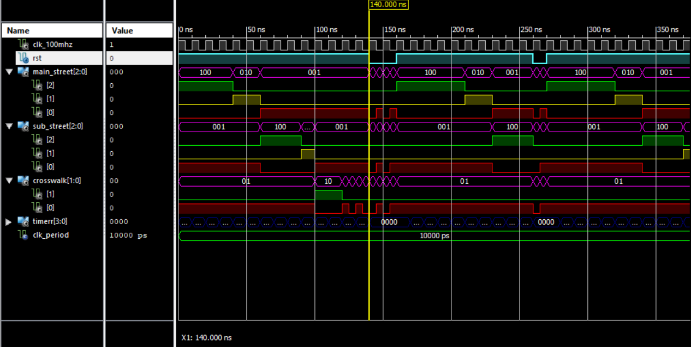

# Traffic Light Controller 🚦

This project implements a VHDL-based traffic signal light controller for an FPGA. The controller manages the flow of traffic at a junction by controlling the lights for the main street, sub street, and crosswalk. It utilizes a finite state machine to transition between different states, simulating a real-world traffic signal.

## Table of Contents

- [Introduction](#introduction)
- [Project Structure](#project-structure)
- [How It Works](#how-it-works)
- [Usage](#usage)
- [Constraints](#constraints)

## Introduction

The traffic signal light controller is designed to operate on an FPGA, controlling the timing and states of the traffic lights. It uses a finite state machine to transition between different states, managing the flow of traffic through the junction.

## Project Structure

The project consists of the following main components:

- `traffic_signal_light.vhdl`: Main VHDL file defining the entity and architecture for the traffic signal light controller.
- `clock_divide.vhdl`: VHDL file for a clock divider component used to generate a 1 Hz signal from the 100 MHz clock.
- `constraints.xdc`: Constraints file specifying the mapping of signals to specific locations on the FPGA.

## How It Works

The traffic signal light controller operates based on a finite state machine with the following states:

- **GaRbRw:** Main street Green, sub street Red, crosswalk Red
- **YaRbRw:** Main street Yellow, sub street Red, crosswalk Red
- **RaGbRw:** Main street Red, sub street Green, crosswalk Red
- **RaYbRw:** Main street Red, sub street Yellow, crosswalk Red
- **RaRbGw:** Main street Red, sub street Red, crosswalk Green
- **RaRbRBw:** Main street Red, sub street Red, crosswalk Red with Blink
- **BLINK:** All red lights are blinking

The controller transitions between these states based on timer values and the 1 Hz clock signal.

## Usage

To use this project, follow these steps:

1. Implement the VHDL code on your FPGA.
2. Ensure the constraints file (`UCF_LEDs.ucf`) is applied appropriately for signal mapping.
3. Power on the FPGA and observe the traffic signal lights.

## Constraints

📍Ensure that the following signals are correctly mapped in your constraints file:

- `clk_100MHz`: 100 MHz clock signal.
- `rst`: Reset signal.
- `main_street[2:0]`: Main street signal.
- `sub_street[2:0]`: Sub street signal.
- `crosswalk[1:0]`: Crosswalk signal.

## Simulation

## Lecture

- **University:** Isfahan University - Faculty of Computer Engineering
- **Course:**  Computer Architecture Lab
- **Date:** December 2023

## Collaboration 🤝

- **[Matin Azami](https://github.com/InFluX-M)**
- **[Sheida Abedpour](https://github.com/SheidaAbedpour)**
